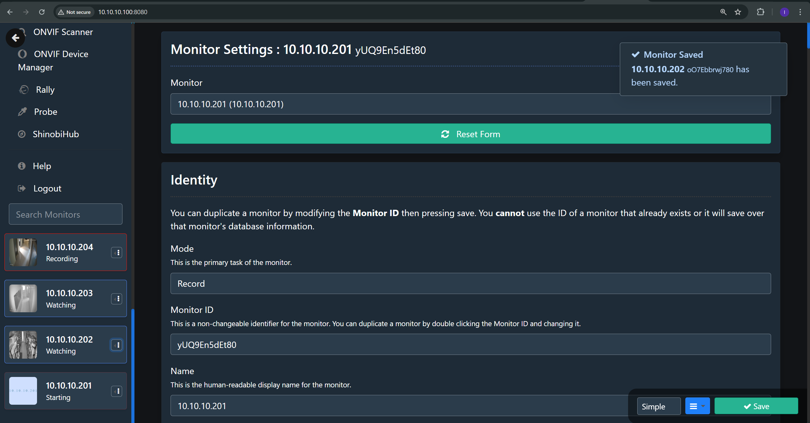
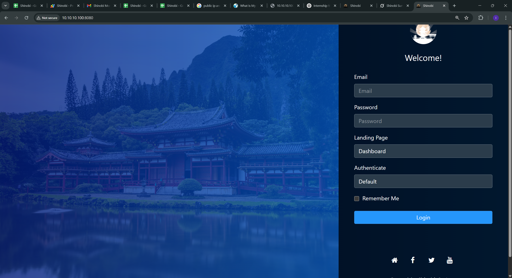
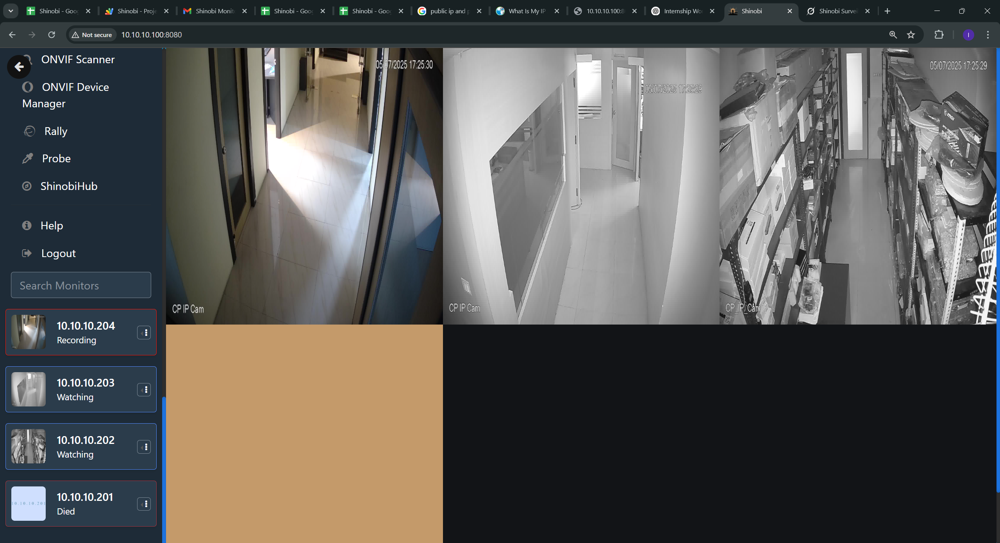

# Shinobi Monitoring System Documentation

## Overview
The Shinobi Monitoring System is designed to monitor the operational status of Shinobi surveillance cameras, log their metrics to a Google Sheet, save data locally as JSON files, and send notifications via email when issues are detected. The system consists of a Python script (`shinobi.py`) that fetches camera status data from a Shinobi server and two Google Apps Scripts (`code.gs` and `ShinobiServerDownNotifier`) for threshold-based and server downtime notifications.

---


## Components

### 1. Python Script (`shinobi.py`)
This script monitors Shinobi cameras, logs their status, and updates a Google Sheet with metrics. It also saves data locally and triggers notifications via an Apps Script endpoint when the server is down.



#### Features
- **Configuration**: Loads settings from a `.env` file using Pydantic for validation.
- **API Integration**: Fetches monitor data from the Shinobi server using its API.
- **Google Sheets**: Appends metrics to a specified Google Sheet.
- **Local Storage**: Saves monitor data as JSON files with log rotation.
- **Logging**: Implements structured JSON logging with rotation (5 MB per file, 5 backups).
- **Notifications**: Sends alerts to a Google Apps Script endpoint for server downtime.
- **Error Handling**: Uses retries, exponential backoff, and graceful shutdown on signals.

#### Configuration
The script uses a `.env` file with the following variables:
```
SHINOBI_HOST=10.10.10.10
SHINOBI_PORT=8080
SHINOBI_API_KEY=UfUL1AcqYC9OkNDpj2jeESeAkaOPRj
SHINOBI_GROUP_KEY=bS1gixfvdu
MONITOR_IDS=["cedXRBYLBP80", "u3YA9NhAI080", "QmaCWgmyll80", "CWBp7pbFZO80"]
SHEET_ID=16co0aMiaJjEoLZr6YYN7ujjSYx9HpVxFwTicY6E2M_c
CREDENTIALS_FILE=shinobi-sheets-credentials.json
SCOPES=["https://spreadsheets.google.com/feeds", "https://www.googleapis.com/auth/drive"]
OUTPUT_DIR=shinobi_output
UPDATE_INTERVAL=60
MAX_RETRIES=3
RETRY_BACKOFF_FACTOR=1.0
MAX_CONSECUTIVE_FAILURES=10
LOG_RETENTION_DAYS=7
APPS_SCRIPT_URL=https://script.google.com/macros/s/AKfycbzxCCbbZDYoycEw2hnncetkZwRzsPv_vqWx94DoZO72jmslAqVmqJY40VymTlHwsxEf/exec
NOTIFICATION_COOLDOWN=600
```

#### Dependencies
The script requires the following Python packages, listed in `requirements.txt`:
```
requests
gspread
oauth2client
pydantic
PyYAML
urllib3
python-dotenv
tenacity
ping3>=4.0.3
openpyxl>=3.1.2
schedule>=1.2.0
requests>=2.31.0
```

#### Metrics
The script tracks:
- **Date and Time**: Local timestamp in the configured timezone.
- **Total Cameras**: Number of monitored cameras.
- **Recording**: Number of cameras actively recording.
- **Not Recording**: Number of cameras not recording.
- **Percentage Recording**: Percentage of cameras recording.
- **Threshold Met**: "Yes" if ≥75% of cameras are recording, else "No".

#### Error Handling
- Retries API calls up to 3 times with exponential backoff.
- Exits after 10 consecutive failures.
- Logs errors in JSON format to both console (INFO level) and file (DEBUG level).

### 2. Google Apps Script: Threshold Monitoring (`code.gs`)
This script runs every 5 minutes to check the last 5 rows in the Google Sheet and sends an email if 3 or more rows have "No" in the "Threshold Met" column.

#### Features
- **Trigger**: Runs every 5 minutes via a time-based trigger.
- **Logic**: Counts "No" values in the last 5 rows of the "Threshold Met" column.
- **Notification**: Sends an email to `edge2intern@gmail.com` with details if the threshold is not met in 3+ rows.
- **Deduplication**: Uses `PropertiesService` to prevent duplicate emails for the same data.

#### Configuration
- **Spreadsheet ID**: `16co0aMiaJjEoLZr6YYN7ujjSYx9HpVxFwTicY6E2M_c`
- **Sheet Name**: `Sheet1`
- **Email**: `edge2intern@gmail.com`

### 3. Google Apps Script: Server Down Notifier (`ShinobiServerDownNotifier`)
This script handles HTTP POST requests from the Python script to send email notifications when the Shinobi server is down.

#### Features
- **Endpoint**: Receives JSON payloads with a `message` field.
- **Notification**: Sends an email to `edge2intern@gmail.com` with the server downtime message.
- **Response**: Returns JSON with `status` and `message`.

#### Configuration
- **Apps Script URL**: Deployed as a web app at the URL specified in the `.env` file.
- **Email**: `edge2intern@gmail.com`

---

## Setup Instructions

### 1. Python Script Setup
1. **Install Dependencies**:
   ```bash
   pip install -r requirements.txt
   ```
   Ensure `requirements.txt` contains:
   ```
   requests
   gspread
   oauth2client
   pydantic
   PyYAML
   urllib3
   python-dotenv
   tenacity
   ping3>=4.0.3
   openpyxl>=3.1.2
   schedule>=1.2.0
   requests>=2.31.0
   ```

2. **Create `.env` File**:
   - Copy the `.env` configuration provided above into a `.env` file in the project directory.
   - Update `SHINOBI_HOST`, `SHINOBI_API_KEY`, `SHINOBI_GROUP_KEY`, `MONITOR_IDS`, `SHEET_ID`, `CREDENTIALS_FILE`, and `APPS_SCRIPT_URL` as needed.

3. **Google Sheets Credentials**:
   - Create a Google Cloud project and enable the Google Sheets and Drive APIs.
   - Generate a service account key and save it as `shinobi-sheets-credentials.json`.
   - Share the Google Sheet with the service account email.

4. **Run the Script**:
   ```bash
   python shinobi_monitor.py
   ```

### 2. Google Apps Script Setup
1. **Threshold Monitoring (`cod
e.gs`)**:
   - Open Google Apps Script (script.google.com).
   - Create a new project and paste the `code.gs` content.
   - Update the `spreadsheet` ID and `emailAddress` if needed.
   - Deploy as a script and set up a time-based trigger (via `createTimeTrigger` function) to run every 5 minutes.

2. **Server Down Notifier (`ShinobiServerDownNotifier`)**:
   - Create a new Apps Script project and paste the provided code.
   - Deploy as a web app with:
     - **Execute as**: You (your Google account).
     - **Who has access**: Anyone (to allow POST requests from the Python script).
   - Copy the web app URL and update `APPS_SCRIPT_URL` in the `.env` file.

---

## Usage
1. **Start the Python Script**:
   - The script runs continuously, checking the Shinobi server every 60 seconds (configurable via `UPDATE_INTERVAL`).
   - It logs metrics to a Google Sheet, saves JSON files in `shinobi_output/`, and sends notifications if the server is down.

2. **Monitor Google Sheet**:
   - Metrics are appended to the specified Google Sheet (`Sheet1`) with columns: Date, Time, Total Cameras, Recording, Percentage Recording, Threshold Met.

3. **Receive Notifications**:
   - **Threshold Alerts**: Emails are sent to `edge2intern@gmail.com` if 3 or more of the last 5 rows in the Google Sheet indicate "No" for the 75% recording threshold.
   - **Server Down Alerts**: Emails are sent when the Shinobi server is unreachable, with a 10-minute cooldown between notifications.

---

## Error Handling and Logging
- **Python Script**:
  - Logs are written to `shinobi_monitor.log` with rotation (5 MB, 5 backups).
  - Console logs show INFO-level messages; file logs include DEBUG-level details.
  - Retries failed API calls and exits after 10 consecutive failures.
- **Apps Scripts**:
  - Logs errors to the Apps Script Logger.
  - The Server Down Notifier returns JSON error responses if email sending fails.

---

## Maintenance
- **Log Retention**: JSON data files older than 7 days are automatically deleted.
- **Google Sheet**: Ensure the sheet has sufficient rows and is shared with the service account.
- **Apps Script Triggers**: Verify the 5-minute trigger for `code.gs` is active.
- **Credentials**: Rotate the Google service account key periodically for security.

---

## Troubleshooting
- **Python Script Fails to Start**:
  - Check if all dependencies are installed (`pip list`).
  - Verify the `.env` file exists and contains all required variables.
  - Ensure the `shinobi-sheets-credentials.json` file is valid and accessible.
- **No Data in Google Sheet**:
  - Confirm the Google Sheet ID and service account permissions.
  - Check logs for authentication or network errors.
- **No Notifications**:
  - Verify the Apps Script URL in `.env` is correct.
  - Check the Apps Script deployment settings and execution logs.
- **Server Unreachable**:
  - Ensure the Shinobi server is running at the specified host and port.
  - Check firewall settings and network connectivity.

---

## Future Enhancements
- Add support for more detailed camera metrics (e.g., uptime, resolution).
- Implement additional notification channels (e.g., Slack, SMS).
- Add a dashboard to visualize camera status in real-time.
- Enhance error recovery with automatic server restart attempts.

---

## Notes
- The system assumes the Shinobi server API is accessible and configured correctly.
- The Google Sheet must have columns in the order: Date, Time, Total Cameras, Recording, Percentage Recording, Threshold Met.
- The Apps Scripts require proper permissions and deployment to function.

For further assistance, contact the system administrator or refer to the Shinobi and Google Apps Script documentation.
